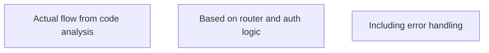

# Global Specification Extractor

Your task is to comprehensively analyze the project's codebase and extract all specifications to produce high-quality specification files that reflect the status quo exactly. This command extracts API contracts, business logic, data models, infrastructure, and UI/UX design specifications in a coordinated manner to ensure consistency and avoid content overlap while enabling proper cross-referencing.

**CRITICAL SUCCESS FACTORS:**
- **Read files completely to the end** - Do not miss any parts of the implementation
- **Focus on actual implementation** - Document what exists, not what should exist
- **Deep code analysis** - Understand structure, relationships, constraints, and business rules
- **Iterative refinement** - Review and improve specifications multiple times

## Process Overview

This unified extractor will create five specification files sequentially in the `specs/` directory, following a dependency-optimized order:

**Phase 1: Foundation Layer**
1. `specs/data-model.md` - Data structures, entities, and relationships (foundational - no dependencies)

**Phase 2: Core Logic Layer**  
2. `specs/infrastructure.md` - Deployment, storage, network, and monitoring (depends on data model)

**Phase 3: Business Layer**
3. `specs/business-logic.md` - User scenarios, business rules, and workflows (depends on data model)

**Phase 4: Interface Layer**
4. `specs/api-contract.md` - Technical interfaces and API specifications (depends on data model and business logic)

**Phase 5: Presentation Layer**
5. `specs/ui-design.md` - UI components, user flows, and UX patterns (depends on business logic and API contract)

This sequential approach ensures that each specification can properly reference and build upon the previously extracted specifications, resulting in higher quality and more accurate cross-references.

## Codebase Analysis Patterns

### API Contract Patterns
**Search for these patterns in the codebase:**
- Controllers, routes, endpoints (directories: `routes/`, `controllers/`, `api/`, `endpoints/`)
- API middleware and authentication (files: `*middleware*`, `*auth*`, `*guard*`)
- Request/response handlers and validation
- Error handling and status codes
- Service interfaces and method signatures
- REST/GraphQL/gRPC endpoint definitions
- API documentation files (OpenAPI, Swagger, etc.)

### Business Logic Patterns
**Search for these patterns in the codebase:**
- Service layer implementations (directories: `services/`, `business/`, `domain/`)
- Business rule implementations and validations (files: `*Service*`, `*Manager*`, `*Handler*`)
- Workflow orchestration and state management
- User scenario implementations in controllers
- Business exception handling
- Domain models and business entities
- Use case implementations

### Data Model Patterns
**Search for these patterns in the codebase:**
- Model definitions (directories: `models/`, `entities/`, `domain/`, `data/`)
- Database schemas and migrations (files: `*Model*`, `*Entity*`, `*Schema*`, `*migration*`)
- Data validation rules and constraints
- Relationship definitions (foreign keys, associations)
- Repository patterns and data access layers (files: `*Repository*`, `*DAO*`, `*DataAccess*`)
- ORM/ODM configurations and mappings

### Infrastructure Patterns
**Search for these patterns in the codebase:**
- Configuration files (files: `*config*`, `*settings*`, `.env*`, `*properties`)
- Build and deployment scripts (files: `*build*`, `*deploy*`, `Dockerfile*`, `*compose*`)
- Database connection and setup files
- Environment-specific configurations
- Monitoring and logging configurations
- CI/CD pipeline definitions (files: `*pipeline*`, `*workflow*`, `.github/`, `.gitlab-ci*`)
- Infrastructure as Code (Terraform, CloudFormation, etc.)

### UI/UX Design Patterns
**Search for these patterns in the codebase:**
- UI components (directories: `components/`, `views/`, `pages/`, `screens/`)
- Routing and navigation (files: `*Router*`, `*Route*`, `*Navigation*`)
- State management (files: `*store*`, `*state*`, `*context*`, `*reducer*`)
- UI styling and theming (files: `*style*`, `*theme*`, `*css*`, `*scss*`, `*less*`)
- User interaction handlers and form validations
- Template files (HTML, JSX, Vue, Angular templates, etc.)
- Mobile UI patterns (Activities, Fragments, ViewControllers, etc.)

## Phase 1: Comprehensive Codebase Analysis

### Step 1: Systematic File Discovery and Cataloging
1. **Complete codebase scan** using targeted search patterns:
   - **Server-side files**: API routes, controllers, services, models, middleware
   - **Client-side files**: Components, pages, contexts, services, utilities
   - **Configuration files**: Environment, build, deployment, database configs
   - **Documentation files**: Existing specs, README files, architectural decisions

2. **Deep file analysis** for each discovered file:
   - **Read files completely to the end** - Critical for accuracy
   - **Understand implementation details** - Not just interfaces
   - **Identify relationships and dependencies** between components
   - **Extract business rules and constraints** from code logic
   - **Note validation patterns and error handling** approaches

### Step 2: Specification Type-Specific Deep Dive Analysis

#### API Contract Analysis
1. **Route examination**: Analyze all route files completely
   - Extract endpoint definitions, HTTP methods, parameters
   - Identify middleware usage (auth, validation, rate limiting)
   - Document request/response structures from actual code
   - Analyze error handling patterns and status codes

2. **Controller analysis**: Examine controller implementations
   - Understand request processing logic
   - Identify validation rules and business logic
   - Document actual response formats (not assumed ones)
   - Note authentication and authorization requirements

3. **Middleware analysis**: Study authentication and validation middleware
   - Document security implementations
   - Understand rate limiting and CORS configurations
   - Identify request/response transformation logic

#### Business Logic Analysis
1. **Service layer examination**: Analyze service implementations
   - Extract business rules from actual code logic
   - Identify workflow patterns and state management
   - Document validation rules and constraints
   - Understand error handling and exception patterns

2. **Controller business logic**: Extract user scenarios from controllers
   - Identify success and failure paths
   - Document business rule enforcement
   - Understand user interaction patterns
   - Extract edge case handling

3. **Model validation analysis**: Study model-level business rules
   - Extract validation constraints from schemas
   - Identify relationship rules and cascading behaviors
   - Document data integrity requirements

#### Data Model Analysis
1. **Schema examination**: Analyze database models completely
   - Extract all fields, types, and constraints
   - Identify relationships and foreign keys
   - Document validation rules and defaults
   - Understand indexing and performance considerations

2. **Migration analysis**: Study database migrations if present
   - Understand schema evolution
   - Identify data transformation patterns
   - Document relationship changes over time

3. **Repository pattern analysis**: Examine data access layers
   - Understand query patterns and optimizations
   - Identify data transformation logic
   - Document caching and performance strategies

#### Infrastructure Analysis
1. **Configuration analysis**: Examine all config files
   - Extract environment-specific settings
   - Identify service dependencies and connections
   - Document security configurations
   - Understand deployment patterns

2. **Build and deployment analysis**: Study build scripts and Docker files
   - Extract deployment processes and requirements
   - Identify service orchestration patterns
   - Document environment setup and dependencies
   - Understand scaling and monitoring configurations

#### UI/UX Design Analysis
1. **Component analysis**: Examine React components completely
   - Extract component structure and props
   - Identify state management patterns
   - Document user interaction handlers
   - Understand styling and theming approaches

2. **Routing analysis**: Study navigation and routing patterns
   - Extract user flow definitions
   - Identify protected routes and authentication flows
   - Document page transitions and state management
   - Understand URL structure and parameters

3. **Context and state analysis**: Examine state management
   - Extract global state patterns
   - Identify data flow and update mechanisms
   - Document user session management
   - Understand performance optimization patterns

## Phase 2: Sequential Specification Extraction

### Pre-Extraction Validation
Before creating specifications, ensure you have:
1. **Complete understanding** of all analyzed files
2. **Identified all cross-references** between different specification types
3. **Mapped dependencies** to follow the sequential order

### Sequential Extraction Process

**Step 1: Data Model Foundation (specs/data-model.md)**
- Extract first as it has no dependencies on other specs
- Focus on entities, relationships, and data structures
- This becomes the foundation for all other specifications

**Step 2: Infrastructure Layer (specs/infrastructure.md)**  
- Extract second, referencing the data model for storage requirements
- Focus on deployment, storage, network, and monitoring
- Can reference data model entities for storage design

**Step 3: Business Logic Layer (specs/business-logic.md)**
- Extract third, referencing data model for entity operations
- Focus on user scenarios, business rules, and workflows
- Can reference data model entities in business rules

**Step 4: API Contract Layer (specs/api-contract.md)**
- Extract fourth, referencing data model and business logic
- Focus on technical interfaces and API specifications
- Can reference data entities and business operations

**Step 5: UI Design Layer (specs/ui-design.md)**
- Extract last, referencing business logic and API contract
- Focus on UI components, user flows, and UX patterns
- Can reference business scenarios and API endpoints
2. **Identified all endpoints, components, and configurations** from actual code
3. **Extracted actual request/response formats** from implementation
4. **Documented real validation rules and constraints** from code
5. **Understood actual error handling patterns** from implementation

### API Contract Extraction

**Enhanced Template for `specs/api-contract.md`:**
```markdown
# API Contract

## Interfaces

### [Interface Name]
[Detailed description of the interface including its purpose, technology stack, and access patterns based on actual implementation]

#### Input/Call
[Document actual request structures from route handlers and controllers]
- **Endpoint**: [HTTP method and path from route definitions]
- **Headers**: [Required headers from middleware analysis]
- **Parameters**: [Path, query, and body parameters from actual code]
- **Validation**: [Actual validation rules from middleware/controllers]

#### Output/Response
[Document actual response structures from controller implementations]
- **Success Response**: [Actual response format from code]
- **Response Headers**: [Headers set by middleware/controllers]
- **Status Codes**: [All possible status codes from implementation]

#### Error Handling
[Document actual error handling from code analysis]
- **Error Types**: [Specific error types thrown in code]
- **Error Structure**: [Actual error response format]
- **Status Codes**: [Error status codes from implementation]
- **Error Middleware**: [Error handling middleware behavior]

#### Authentication & Authorization
[Document actual auth implementation]
- **Authentication Method**: [JWT, session, etc. from middleware]
- **Required Permissions**: [Role/permission checks from code]
- **Token Handling**: [Token validation and refresh logic]

#### Rate Limiting & Security
[Document actual security implementations]
- **Rate Limits**: [Actual rate limiting configuration]
- **CORS Settings**: [CORS middleware configuration]
- **Security Headers**: [Helmet or security middleware settings]

#### Other Characteristics
[Implementation-specific details from code analysis]
- **Middleware Chain**: [Actual middleware order and behavior]
- **Database Interactions**: [Query patterns and transactions]
- **Performance Considerations**: [Caching, pagination, optimization]

## Implementation Notes
[Document any discrepancies between expected and actual behavior]

## Cross-References
- **Data Models**: Reference specific entities and fields from `specs/data-model.md`
- **Business Logic**: Reference specific scenarios and rules from `specs/business-logic.md`
- **Infrastructure**: Reference deployment and security from `specs/infrastructure.md`

## Open Questions
[Specific questions about unclear implementation details]
```

### Business Logic Extraction

**Enhanced Template for `specs/business-logic.md`:**
```markdown
# Business Logic

## Overview
[Comprehensive description based on actual implementation analysis, including business value and user impact]

## User Scenarios

### [Scenario Name]
**As a** [user type from actual user model]
**I want** [capability from actual feature implementation]
**So that** [business value from actual use cases]

#### Implementation Details
[How this scenario is actually implemented in the codebase]
- **Entry Points**: [Controllers/routes that handle this scenario]
- **Service Layer**: [Services and business logic implementations]
- **Data Layer**: [Models and database interactions involved]

#### Success Criteria
[Measurable outcomes based on actual implementation]
- [Specific success conditions from code logic]

#### Business Rules
[Actual business rules extracted from code implementation]
- **When** [condition from actual validation/logic] **Then** [behavior from actual code] **Because** [business reason from comments/context]

#### Validation Rules
[Actual validation from models, middleware, and controllers]
- **Field Validation**: [Specific validation rules from code]
- **Business Validation**: [Complex business rule validation]
- **Cross-Entity Validation**: [Validation involving multiple models]

#### Edge Cases & Exceptions
[Actual edge case handling from code analysis]
- **When** [condition from actual error handling] **Then** [behavior from actual code] **Because** [business reason from implementation]

#### Error Scenarios
[Actual error handling patterns from implementation]
- **Validation Errors**: [How validation failures are handled]
- **Business Rule Violations**: [How business rule violations are handled]
- **System Errors**: [How system errors are handled and communicated]

## Workflow Patterns
[Actual workflow implementations from service layer]

### [Workflow Name]
[Step-by-step workflow based on actual service implementations]

## Cross-References
- **API Contract**: Reference specific endpoints from `specs/api-contract.md`
- **Data Model**: Reference specific entities and relationships from `specs/data-model.md`
- **UI Design**: Reference specific user flows from `specs/ui-design.md`

## Implementation Notes
[Notes about implementation patterns, design decisions, and technical debt]

## Open Questions
[Specific questions about business logic that need clarification]
```

### Data Model Extraction

**Enhanced Template for `specs/data-model.md`:**
```markdown
# Data Model

## Model Elements

### [Element Name]
[Comprehensive description of the model element based on actual schema definition and usage patterns]

#### Structure
[Complete field definition from actual model/schema]
```javascript
// Actual schema structure from code
{
  fieldName: {
    type: DataType,
    required: boolean,
    default: value,
    validate: validationFunction,
    // ... other actual properties
  }
}
```

#### Validation Rules
[Actual validation rules from schema and application code]
- **[Field Name]**: [Specific validation rule from code]
- **Schema Validation**: [Mongoose/ORM validation from model definition]
- **Application Validation**: [Additional validation in controllers/services]

#### Relationships
[Actual relationships from schema definitions and population logic]
- **[Field Name]**: [Relationship type and target model from actual code]
- **Population Logic**: [How relationships are populated in queries]
- **Cascade Behavior**: [Actual cascade delete/update behavior]

#### Indexes and Performance
[Actual database indexes and performance optimizations]
- **Indexes**: [Actual index definitions from schema]
- **Query Patterns**: [Common query patterns from repository/service code]
- **Performance Considerations**: [Actual performance optimizations]

#### Business Logic Integration
[How this model is used in business logic]
- **Creation Logic**: [How instances are created in services]
- **Update Logic**: [How instances are updated and validated]
- **Deletion Logic**: [Soft delete, cascade behavior, etc.]

#### Other Characteristics
[Implementation-specific details from model analysis]
- **Middleware**: [Pre/post hooks and middleware from schema]
- **Virtual Fields**: [Computed fields and virtual properties]
- **Instance Methods**: [Custom methods defined on the model]
- **Static Methods**: [Static methods for queries and operations]

## Data Flow Patterns
[How data flows through the application based on actual implementation]

## Cross-References
- **API Contract**: Reference endpoints that use this model from `specs/api-contract.md`
- **Business Logic**: Reference scenarios involving this model from `specs/business-logic.md`
- **Infrastructure**: Reference storage and persistence from `specs/infrastructure.md`

## Implementation Notes
[Notes about model design decisions, migrations, and technical considerations]

## Open Questions
[Specific questions about data model design and relationships]
```

### Infrastructure Extraction

**Enhanced Template for `specs/infrastructure.md`:**
```markdown
# Infrastructure

## Deployment
[Actual deployment configuration from Docker, docker-compose, and build scripts]

### Development Environment
[Actual development setup from docker-compose and package.json]
- **Services**: [Actual services defined in docker-compose]
- **Dependencies**: [Service dependencies and startup order]
- **Port Configuration**: [Actual port mappings and networking]
- **Volume Mounts**: [Data persistence and file sharing]

### Production Considerations
[Production-ready configurations and considerations]
- **Environment Variables**: [Required environment variables from .env files]
- **Build Process**: [Actual build steps from Dockerfile and scripts]
- **Health Checks**: [Health check implementations]

## Storage
[Actual storage configuration and database setup]

### Database Configuration
[Actual database setup from config files and connection logic]
- **Database Type**: [MongoDB, PostgreSQL, etc. from actual config]
- **Connection Configuration**: [Connection strings and pool settings]
- **Migration Strategy**: [How schema changes are handled]

### File Storage
[Actual file storage implementation if present]
- **Storage Type**: [Local, cloud storage, etc.]
- **Upload Handling**: [File upload middleware and processing]

## Network
[Actual network configuration from server setup and middleware]

### API Configuration
[Actual API server configuration]
- **Server Framework**: [Express, Fastify, etc. from actual implementation]
- **Port Configuration**: [Actual port settings from server.js]
- **Middleware Stack**: [Actual middleware order and configuration]

### CORS and Security
[Actual CORS and security middleware configuration]
- **CORS Settings**: [Actual CORS configuration from middleware]
- **Security Headers**: [Helmet configuration and security headers]
- **Rate Limiting**: [Actual rate limiting implementation]

## Security
[Actual security implementations from middleware and configuration]

### Authentication
[Actual authentication implementation]
- **JWT Configuration**: [JWT secret, expiration, and validation]
- **Password Security**: [Hashing algorithm and salt rounds]
- **Session Management**: [How sessions are managed]

### Authorization
[Actual authorization patterns from middleware]
- **Role-Based Access**: [How roles and permissions are implemented]
- **Route Protection**: [How routes are protected]

## Monitoring
[Actual monitoring and logging implementation]

### Logging
[Actual logging configuration and patterns]
- **Log Levels**: [Configured log levels and output]
- **Log Format**: [Log format and structured logging]
- **Error Tracking**: [How errors are logged and tracked]

### Health Monitoring
[Actual health check and monitoring implementation]
- **Health Endpoints**: [Health check endpoints and logic]
- **Performance Monitoring**: [Performance tracking implementation]

## Cross-References
- **API Contract**: Reference security and deployment from `specs/api-contract.md`
- **Data Model**: Reference storage and persistence from `specs/data-model.md`
- **UI Design**: Reference frontend deployment from `specs/ui-design.md`

## Implementation Notes
[Notes about infrastructure decisions, technical debt, and improvements needed]

## Open Questions
[Specific questions about infrastructure configuration and deployment]
```

### UI/UX Design Extraction

**Enhanced Template for `specs/ui-design.md`:**
```markdown
# UI/UX Design

## Technology Stack
[Actual frontend technology stack from package.json and implementation]
- **Framework**: [React, Vue, Angular, etc. from actual code]
- **Build Tool**: [Vite, Webpack, etc. from actual configuration]
- **Styling**: [CSS, Tailwind, styled-components, etc. from actual implementation]
- **State Management**: [Context, Redux, Zustand, etc. from actual code]

## UI Components

### [Component Name]
[Detailed component description based on actual implementation]

#### Component Structure
[Actual component structure from code]
```jsx
// Actual component signature and props from code
function ComponentName({ prop1, prop2, ...props }) {
  // Key implementation details
}
```

#### Props and State
[Actual props and state management from component code]
- **Props**: [Actual prop types and usage from code]
- **State**: [Local state management patterns from code]
- **Context Usage**: [How component uses global state/context]

#### Styling and Theming
[Actual styling implementation from component files]
- **CSS Classes**: [Actual CSS classes and styling approach]
- **Responsive Design**: [Breakpoints and responsive patterns]
- **Theme Integration**: [How theming is implemented]

#### Event Handling
[Actual event handling patterns from component code]
- **User Interactions**: [Click, form submission, etc. from actual handlers]
- **API Integration**: [How component interacts with backend]
- **State Updates**: [How user actions update state]

## User Flows

### [Flow Name]
[Actual user flow based on routing and component interactions]

#### Flow Implementation
[How the flow is actually implemented in code]
- **Route Configuration**: [Actual routes from router configuration]
- **Component Sequence**: [Components involved in the flow]
- **State Management**: [How state flows through the user journey]
- **API Interactions**: [Backend calls during the flow]

#### Authentication Flow
[Actual authentication flow from auth context and components]


## UX Patterns

### [Pattern Name]
[Actual UX pattern implementation from component analysis]

#### Implementation Details
[How the pattern is actually implemented]
- **Component Structure**: [Components that implement the pattern]
- **State Management**: [How pattern state is managed]
- **User Feedback**: [Loading states, error messages, success feedback]

#### Accessibility
[Actual accessibility implementation from component code]
- **ARIA Labels**: [Actual ARIA implementation from code]
- **Keyboard Navigation**: [Keyboard support implementation]
- **Screen Reader Support**: [Screen reader considerations]

## Performance Patterns
[Actual performance optimizations from code]
- **Code Splitting**: [Lazy loading and code splitting implementation]
- **Memoization**: [React.memo, useMemo, useCallback usage]
- **Bundle Optimization**: [Build optimization from vite.config.js]

## Cross-References
- **Business Logic**: Reference user scenarios from `specs/business-logic.md`
- **API Contract**: Reference client-server interactions from `specs/api-contract.md`
- **Infrastructure**: Reference frontend deployment from `specs/infrastructure.md`

## Implementation Notes
[Notes about UI/UX decisions, technical debt, and improvement opportunities]

## Open Questions
[Specific questions about UI/UX implementation and design decisions]
```

## Phase 3: Cross-Reference Integration

### Step 1: Identify Relationships
1. **Map connections** between specifications:
   - API endpoints ↔ Business scenarios ↔ Data models
   - UI components ↔ User flows ↔ API calls
   - Infrastructure ↔ Deployment ↔ All other specs
   - Consider technology-specific relationships (microservices, event-driven, etc.)

2. **Add cross-references** in each specification:
   - Use consistent naming conventions
   - Reference specific sections in other specifications
   - Avoid duplicating content across specifications
   - Account for different architectural patterns (monolith, microservices, serverless, etc.)

### Step 2: Ensure Content Separation
1. **API Contract**: Focus only on technical interface definitions
2. **Business Logic**: Focus only on business rules and user scenarios
3. **Data Model**: Focus only on data structure and relationships
4. **Infrastructure**: Focus only on deployment and operational concerns
5. **UI Design**: Focus only on user interface and experience

## Phase 4: Iterative Refinement and Cross-Validation

### Specification Review Process

After creating each specification, perform these validation steps:

#### 1. Implementation Accuracy Check
- **Verify all documented endpoints exist** in the actual codebase
- **Confirm all data structures match** actual model definitions
- **Validate all business rules** are extracted from real code logic
- **Check all error handling** matches actual implementation

#### 2. Completeness Validation
- **Ensure no major components are missing** from the specification
- **Verify all user-facing features** are documented
- **Confirm all API endpoints** are covered
- **Check all data models** are included

#### 3. Cross-Reference Consistency
- **Verify API Contract references** match actual Data Model entities
- **Ensure Business Logic scenarios** align with API Contract endpoints
- **Confirm UI Design flows** match Business Logic scenarios
- **Validate Infrastructure** supports all documented features

#### 4. Technical Depth Assessment
- **Ensure sufficient implementation detail** for developers
- **Verify actual code patterns** are documented
- **Confirm configuration details** are accurate
- **Check performance considerations** are included

### Refinement Iterations

For each specification that doesn't meet the quality standards:

#### Round 1: Gap Analysis
1. **Identify missing implementation details** by re-examining code
2. **Find undocumented endpoints or components** through deeper code search
3. **Locate missing business rules** in service layer code
4. **Discover additional error handling** patterns

#### Round 2: Detail Enhancement
1. **Add specific code examples** and configurations
2. **Include actual validation rules** from models and middleware
3. **Document real error messages** and status codes
4. **Add performance and security considerations**

#### Round 3: Integration Validation
1. **Ensure all cross-references** are accurate and complete
2. **Verify specification consistency** across all documents
3. **Confirm implementation feasibility** of documented features
4. **Validate business value alignment** with technical implementation

### Quality Gates

Before considering any specification complete, ensure:

✅ **Implementation Fidelity**: Every documented feature exists in code
✅ **Technical Depth**: Sufficient detail for implementation without guesswork
✅ **Business Alignment**: Clear connection between business value and technical implementation
✅ **Cross-Reference Accuracy**: All references between specifications are valid
✅ **Completeness**: No major features or components are missing
✅ **Actionability**: Specifications provide clear guidance for development

### Final Validation

After all specifications are complete:

1. **Perform end-to-end consistency check** across all five specifications
2. **Verify implementation completeness** by checking against actual codebase
3. **Validate business scenario coverage** matches actual user flows
4. **Confirm technical architecture** is accurately represented
5. **Ensure all open questions** are documented for follow-up

## Success Metrics

The unified extraction process should achieve:
- **Implementation Accuracy**: 95%+ of documented features exist in code
- **Technical Completeness**: All major components and patterns documented
- **Cross-Reference Consistency**: 100% valid references between specifications
- **Business Alignment**: Clear traceability from business value to implementation
- **Developer Usability**: Specifications provide sufficient detail for implementation

## Troubleshooting Common Issues

### Low Implementation Accuracy
- **Re-read files completely** to catch missed details
- **Search for additional patterns** using different keywords
- **Examine configuration files** more thoroughly
- **Check for dynamic or conditional logic** in code

### Missing Technical Depth
- **Focus on actual code implementations** rather than assumptions
- **Document specific configurations** and middleware
- **Include actual error handling** and validation logic
- **Add performance and security considerations**

### Poor Cross-Reference Quality
- **Verify entity names** match across specifications
- **Ensure endpoint paths** are consistent
- **Check business scenario alignment** with technical implementation
- **Validate data flow** between components

### Incomplete Business Logic
- **Examine service layer code** more thoroughly
- **Look for validation logic** in multiple locations
- **Check for business rules** in middleware and models
- **Review error handling** for business rule violations

## Execution Instructions

1. **Start with comprehensive codebase scanning** using the defined patterns
2. **Create all five specification files** in the `specs/` directory in sequential order:
   - specs/data-model.md (Foundation)
   - specs/infrastructure.md (Core Logic)
   - specs/business-logic.md (Business Layer)
   - specs/api-contract.md (Interface Layer)
   - specs/ui-design.md (Presentation Layer)
3. **Extract content sequentially** following the dependency-optimized order
4. **Add cross-references** as you build upon previously extracted specifications
5. **Review and refine** all specifications for accuracy and completeness
6. **Ensure no content duplication** while maintaining proper referencing

The final result should be five cohesive, cross-referenced specification files in the `specs/` directory that together provide a complete picture of the project without overlapping content, with each specification properly building upon the foundation established by the previous ones.